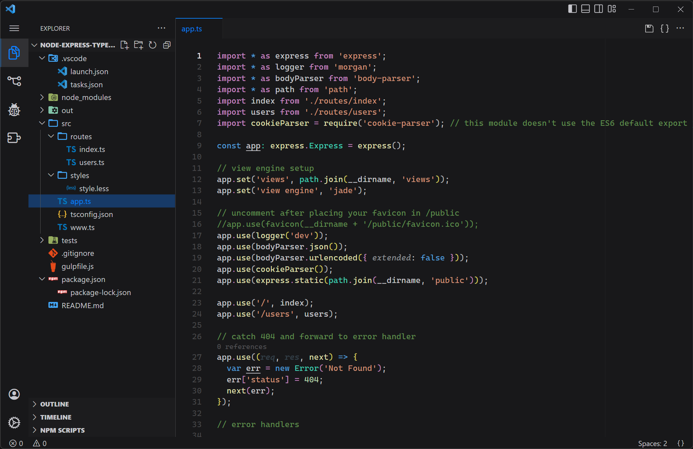
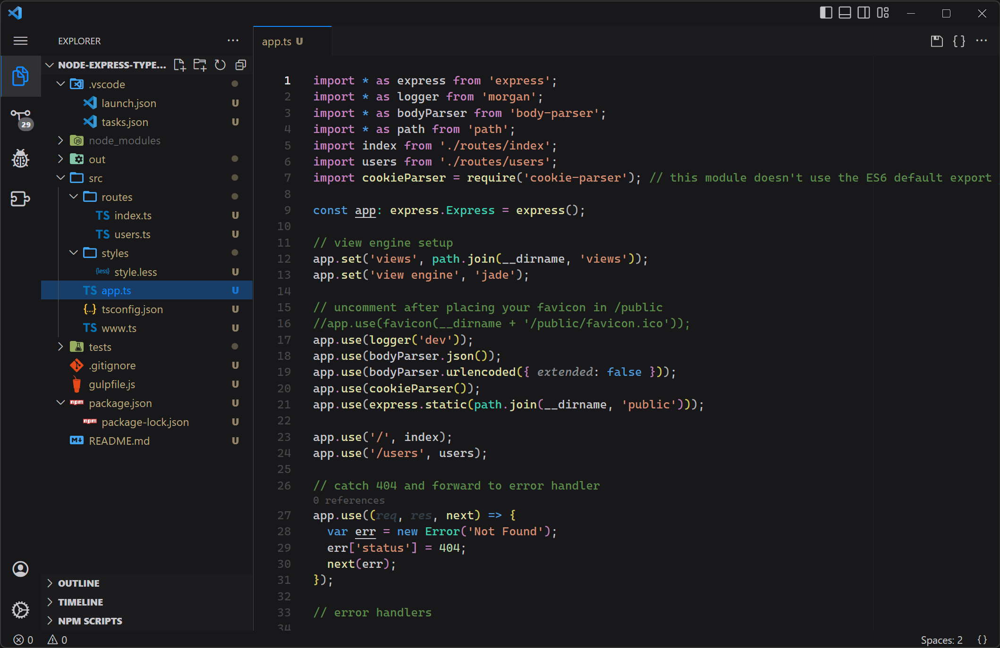
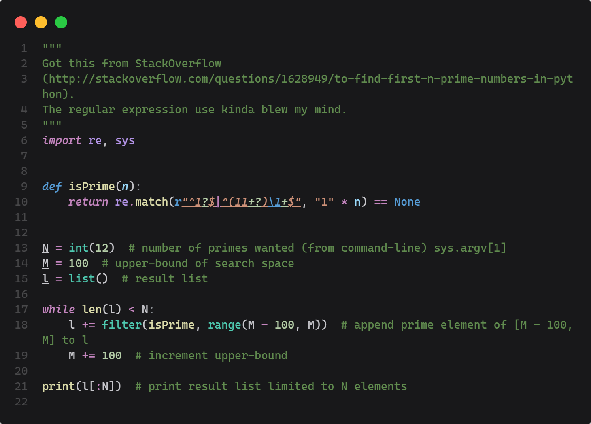
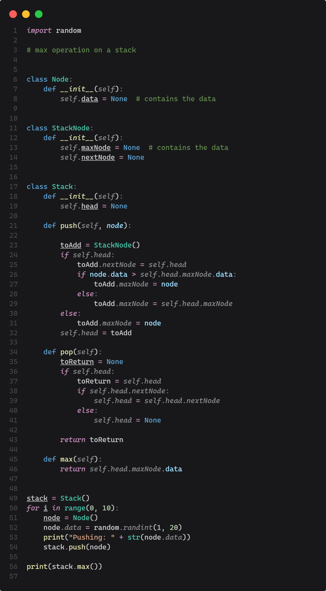

# Ruzzy Theme - Dark

Simple, Dimmed Dark Theme for Visual Studio Code  
Highlight colors are based on [Apple Developer](https://developer.apple.com/design/human-interface-guidelines/foundations/color/)'s UI Colors

 

## 🖼 Screenshots

### Interface

|                    Blue                     |                      Green                      |
| :-----------------------------------------: | :---------------------------------------------: |
|     |        |
|                   Orange                    |                     Purple                      |
|   |       |
|                     Red                     |                     Yellow                      |
|      |       |
|                   Default                   |          Default (with git decoration)          |
|  |  |

### Syntax Colors

	

    

 

## 📃 For more information

-   [Visual Studio Code's Markdown Support](http://code.visualstudio.com/docs/languages/markdown)
-   [Markdown Syntax Reference](https://help.github.com/articles/markdown-basics/)

 

## 🔦 Semantic Highlight Enabled

This theme supports semantic highlight by default

-   [Semantic Highlight Guide](https://code.visualstudio.com/api/language-extensions/semantic-highlight-guide)

### Enabling Semantic Highlight

Set `true` to enable semantic highlight

> Settings > Editor > Semantic Highlighting: Enabled  
> `configuredByTheme` or `true`

### Token Colors

-   Based on VSCode Default Dark+ Theme
-   Based on [dark-plus-syntax](https://marketplace.visualstudio.com/items?itemName=dunstontc.dark-plus-syntax)
-   Inspired by [Dark+ Material](https://marketplace.visualstudio.com/items?itemName=vangware.dark-plus-material)

 

## 🎨 UI Colors

-   Based on [Apple Developer](https://developer.apple.com/design/human-interface-guidelines/foundations/color/)'s UI Colors

 

### Accent Colors

1.  Default Blue

    

    | Color     | Alpha       | Usage   |
    | --------- | ----------- | ------- |
    | `#128cff` | `FF` : 100% | accent  |
    | `#0d62b3` | `80` : 50%  | overlay |

    

2.  MacOS Blue

    

    | Color     | Alpha       | Usage   |
    | --------- | ----------- | ------- |
    | `#0a84ff` | `FF` : 100% | accent  |
    | `#075cb3` | `80` : 50%  | overlay |

    

3.  MacOS Orange

    

    | Color     | Alpha       | Usage   |
    | --------- | ----------- | ------- |
    | `#ff9f0a` | `FF` : 100% | accent  |
    | `#b36f07` | `80` : 50%  | overlay |

    

4.  MacOS Green

    

    | Color     | Alpha       | Usage   |
    | --------- | ----------- | ------- |
    | `#30d158` | `FF` : 100% | accent  |
    | `#22923e` | `80` : 50%  | overlay |

    

5.  MacOS Purple

    

    | Color     | Alpha       | Usage   |
    | --------- | ----------- | ------- |
    | `#bf5af2` | `FF` : 100% | accent  |
    | `#863fa9` | `80` : 50%  | overlay |

    

6.  MacOS Red

    

    | Color     | Alpha       | Usage   |
    | --------- | ----------- | ------- |
    | `#ff453a` | `FF` : 100% | accent  |
    | `#b33029` | `80` : 50%  | overlay |

    

7.  MacOS Yellow

    

    | Color     | Alpha       | Usage   |
    | --------- | ----------- | ------- |
    | `#ffd60a` | `FF` : 100% | accent  |
    | `#b39607` | `80` : 50%  | overlay |

    

 

### Grayscale Colors

1. Light-Gray

    

    | Color     | Alpha       | Usage             |
    | --------- | ----------- | ----------------- |
    | `#f2f2f7` | `FF` : 100% | white             |
    | `#e5e5ea` | `FF` : 100% | button foreground |
    | `#d1d1d6` | `FF` : 100% | main foreground   |
    | `#c7c7cc` | `FF` : 100% | text foreground   |
    | `#aeaeb2` | `FF` : 100% | desc foreground   |

    

2. Neutral-Gray

    

    | Color     | Alpha       | Usage               |
    | --------- | ----------- | ------------------- |
    | `#8e8e93` | `FF` : 100% | inactive foreground |

    

3. Dark-Gray

    

    | Color     | Alpha       | Usage                           |
    | --------- | ----------- | ------------------------------- |
    | `#636366` | `FF` : 100% | border                          |
    | `#636366` | `C0` : 75%  | hover (translucent)             |
    | `#48484a` | `FF` : 100% | selection / dark border         |
    | `#48484a` | `C0` : 75%  | selection bg (translucent)      |
    | `#3a3a3c` | `FF` : 100% | dark selection background       |
    | `#3a3a3c` | `C0` : 75%  | dark selection bg (translucent) |
    | `#2c2c2e` | `C0` : 75%  | widget background (glass)       |
    | `#1c1c1e` | `FA` : 98%  | widget background (translucent) |
    | `#1c1c1e` | `FF` : 100% | editor background               |
    | `#18181a` | `FF` : 100% | ui background                   |

    

4. Transparent

    

    | Color     | Alpha     | Usage       |
    | --------- | --------- | ----------- |
    | `#000000` | `00` : 0% | transparent |

    

 

### Special Colors

| Color     | Alpha       | Usage    |
| --------- | ----------- | -------- |
| `#4cbf56` | `FF` : 100% | peekview |
| `#e47127` | `FF` : 100% | debug    |
| `#79b8ff` | `FF` : 100% |          |
| `#b392f0` | `FF` : 100% |          |
| `#ff9800` | `FF` : 100% |          |
| `#ff5c8d` | `FF` : 100% |          |

 

**Enjoy!**
