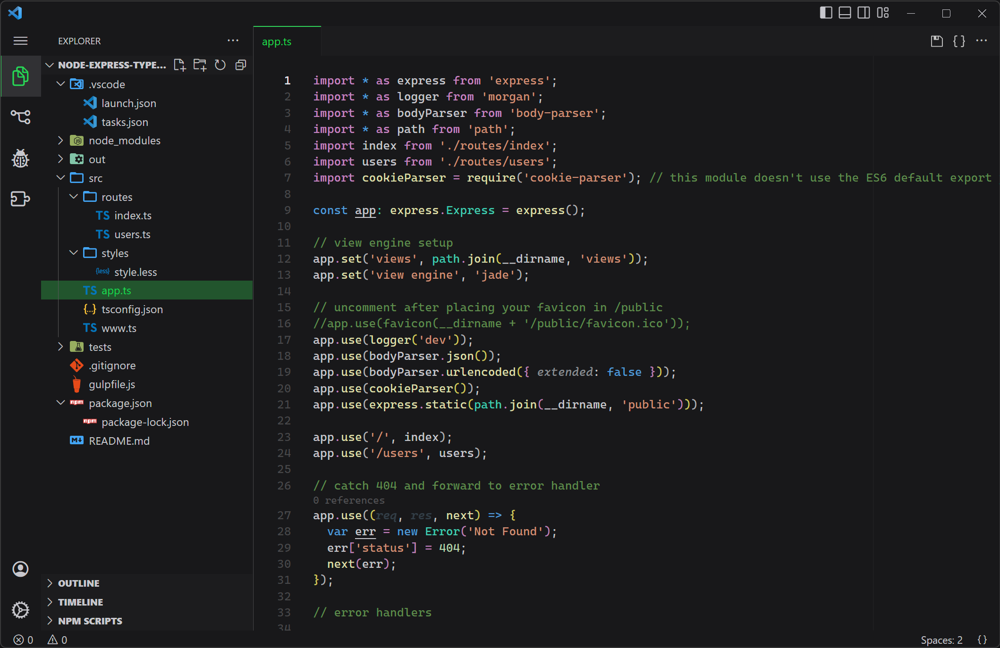

# Ruzzy Theme - Dark

Simple, Dimmed Dark Theme for Visual Studio Code  
Highlight colors are based on [Apple Developer](https://developer.apple.com/design/human-interface-guidelines/foundations/color/)'s UI Colors

 

## 📷 Screenshot

### Interface

#### Git decoration

|                                            |                                            |
| :----------------------------------------: | :----------------------------------------: |
|  Gray   |  Green  |
|    |   |
| Orange  | Purple  |
|  |  |
|   Red   | Yellow  |
|     |  |

### Syntax Colors

	

    

 

## 🔦 Semantic Highlight Enabled

This theme supports semantic highlight by default

- [Semantic Highlight Guide](https://code.visualstudio.com/api/language-extensions/semantic-highlight-guide)

### Enabling Semantic Highlight

Set `true` to enable semantic highlight

> Settings > Editor > Semantic Highlighting: Enabled  
> `configuredByTheme` or `true`

### Token Colors

- Based on VSCode Default Dark+ Theme
- Based on [dark-plus-syntax](https://marketplace.visualstudio.com/items?itemName=dunstontc.dark-plus-syntax)
- Inspired by [Dark+ Material](https://marketplace.visualstudio.com/items?itemName=vangware.dark-plus-material)

 

## 🎨 UI Colors

- Based on [Apple Developer](https://developer.apple.com/design/human-interface-guidelines/foundations/color/)'s UI Colors

 

### Accent Colors

- MacOS Blue

   

  |                                                | Color     | Alpha       | Usage   |
  | ---------------------------------------------- | --------- | ----------- | ------- |
  |  | `#0a84ff` | `FF` : 100% | accent  |
  |  | `#075cb3` | `80` : 50%  | overlay |

   

- MacOS Orange

   

  |                                                | Color     | Alpha       | Usage   |
  | ---------------------------------------------- | --------- | ----------- | ------- |
  |  | `#ff9f0a` | `FF` : 100% | accent  |
  |  | `#b36f07` | `80` : 50%  | overlay |

   

- MacOS Green

   

  |                                                | Color     | Alpha       | Usage   |
  | ---------------------------------------------- | --------- | ----------- | ------- |
  |  | `#30d158` | `FF` : 100% | accent  |
  |  | `#22923e` | `80` : 50%  | overlay |

   

- MacOS Purple

   

  |                                                | Color     | Alpha       | Usage   |
  | ---------------------------------------------- | --------- | ----------- | ------- |
  |  | `#bf5af2` | `FF` : 100% | accent  |
  |  | `#863fa9` | `80` : 50%  | overlay |

   

- MacOS Red

   

  |                                                | Color     | Alpha       | Usage   |
  | ---------------------------------------------- | --------- | ----------- | ------- |
  |  | `#ff453a` | `FF` : 100% | accent  |
  |  | `#b33029` | `80` : 50%  | overlay |

   

- MacOS Yellow

   

  |                                                | Color     | Alpha       | Usage   |
  | ---------------------------------------------- | --------- | ----------- | ------- |
  |  | `#ffd60a` | `FF` : 100% | accent  |
  |  | `#b39607` | `80` : 50%  | overlay |

   

- Gray

   

  |                                                | Color     | Alpha       | Usage      |
  | ---------------------------------------------- | --------- | ----------- | ---------- |
  |  | `#7a818d` | `FF` : 100% | accent     |
  |  | `#555a63` | `80` : 50%  | overlay    |
  |  | `#e3e5e8` | `FF` : 100% | foreground |

   

 

### Grayscale Colors

1. Light-Gray

   

   |                                                | Color     | Alpha       | Usage             |
   | ---------------------------------------------- | --------- | ----------- | ----------------- |
   |  | `#f2f2f7` | `FF` : 100% | white             |
   |  | `#e5e5ea` | `FF` : 100% | button foreground |
   |  | `#d1d1d6` | `FF` : 100% | main foreground   |
   |  | `#c7c7cc` | `FF` : 100% | text foreground   |
   |  | `#aeaeb2` | `FF` : 100% | desc foreground   |

   

2. Neutral-Gray

   

   |                                                | Color     | Alpha       | Usage               |
   | ---------------------------------------------- | --------- | ----------- | ------------------- |
   |  | `#8e8e93` | `FF` : 100% | inactive foreground |

   

3. Dark-Gray

   

   |                                            | Color     | Alpha       | Usage                           |
   | ------------------------------------------ | --------- | ----------- | ------------------------------- |
   |  | `#636366` | `FF` : 100% | border                          |
   |  | `#636366` | `BF` : 75%  | hover (translucent)             |
   |  | `#48484a` | `FF` : 100% | selection / dark border         |
   |  | `#48484a` | `BF` : 75%  | selection bg (translucent)      |
   |  | `#3a3a3c` | `BF` : 75%  | dark selection bg (translucent) |
   |  | `#3a3a3c` | `FF` : 100% | dark selection background       |
   |  | `#2c2c2e` | `54` : 33%  | rulers (low contrast)           |
   |  | `#2c2c2e` | `BF` : 75%  | widget background (glass)       |
   |  | `#1c1c1e` | `FA` : 98%  | widget background (translucent) |
   |  | `#1c1c1e` | `FF` : 100% | editor background               |
   |  | `#18181a` | `FF` : 100% | ui background                   |

   

4. Transparent

   

   | Color     | Alpha      | Usage          |
   | --------- | ---------- | -------------- |
   | `#000000` | `00` : 0%  | transparent    |
   | `#000000` | `1A` : 10% | transparent bg |
   | `#000000` | `66` : 40% | unnecessary    |
   | `#000000` | `80` : 50% | shadow         |

   

 

### Symbol Colors

|                                            | Color     | Usage                                         | Name                |
| ------------------------------------------ | --------- | --------------------------------------------- | ------------------- |
|  | `#E47127` | debug, remote                                 | Russet Orange       |
|  | `#77CCFF` | folder, file                                  | Bubbly Barracuda    |
|  | `#77BBFF` | field,variable                                | Cooler Than Ever    |
|  | `#C8C7CB` | property                                      | Centre Stage        |
|  | `#47C6AC` | class                                         | Disc Jockey         |
|  | `#5BA0D0` | interface, object, constant, keyword, boolean | Picton Blue         |
|  | `#C58BBA` | module, namespace, operator, null             | Rock Star Pink      |
|  | `#CCC050` | constructor, package                          | Sulphur Yellow      |
|  | `#99C285` | enumerator, struct                            | Picnic              |
|  | `#B3CEAB` | enumerator member, number                     | Gio Ponti Green     |
|  | `#B195E4` | function                                      | Dreamy Candy Forest |
|  | `#EE9922` | event                                         | Burning Trail       |
|  | `#DDDDAA` | method                                        | Spaghetti Carbonara |
|  | `#D3A083` | string                                        | Orange Maple        |
|  | `#AEAFB4` | etc                                           | Aluminium Snow      |

### Syntax Colors

|                                            | Color     | Usage                             | Name                |
| ------------------------------------------ | --------- | --------------------------------- | ------------------- |
|  | `#C8C7CB` | variable, text, module, namespace | Centre Stage        |
|  | `#8C8D91` | property                          | Aluminum Silver     |
|  | `#AEAFB4` | docstring, typeHintComment        | Aluminium Snow      |
|  | `#9BDDFF` | parameter                         | Columbia Blue       |
|  | `#5BA0D0` | keyword, type:defaultLibrary      | Picton Blue         |
|  | `#C58BBA` | keyword:python, macro, operator   | Rock Star Pink      |
|  | `#47C6AC` | class, type                       | Disc Jockey         |
|  | `#B3CEAB` | numeric, interface                | Gio Ponti Green     |
|  | `#99C285` | enum, struct                      | Picnic              |
|  | `#DDDDAA` | function, method                  | Spaghetti Carbonara |
|  | `#EE9922` | event                             | Burning Trail       |
|  | `#CCC050` | decorator                         | Sulphur Yellow      |
|  | `#618A4D` | comment                           | Topiary Sculpture   |
|  | `#D3A083` | string                            | Orange Maple        |
|  | `#D58165` | regexp                            | Summer Sunset       |

 

**Enjoy!**
